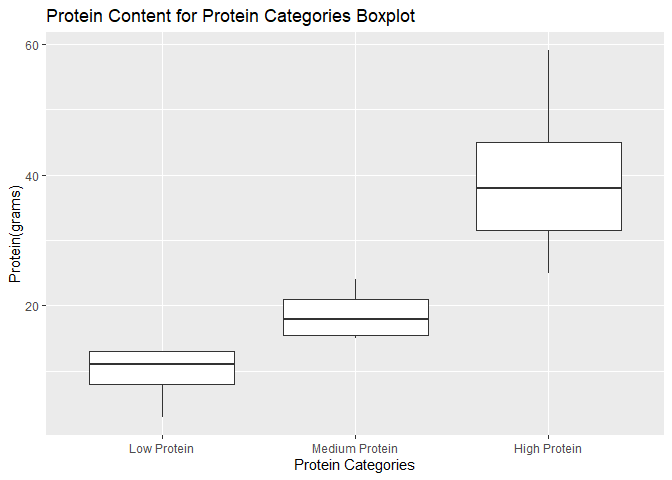

Project 2 F Stat 558
================
Cartron and Rao
9/30/2022

-   [Requirements](#requirements)
-   [Functions to Interact With the API and Process
    Data](#functions-to-interact-with-the-api-and-process-data)
    -   [recipe_query](#recipe_query)
    -   [recipe_query_nutrition](#recipe_query_nutrition)
    -   [combine_recipe_dfs](#combine_recipe_dfs)
-   [Exploratory Data Analysis](#exploratory-data-analysis)
    -   [Creation of Contingency
        Tables](#creation-of-contingency-tables)
    -   [Creation of Data
        Visualizations](#creation-of-data-visualizations)
        -   [Bar Plot - Procat](#bar-plot---procat)
        -   [Scatter Plot - Calories
            vs. Protein](#scatter-plot---calories-vs-protein)
        -   [Histogram - Calories](#histogram---calories)
        -   [Histogram - Protein](#histogram---protein)
        -   [Box Plot - Procat vs
            Protein](#box-plot---procat-vs-protein)
-   [Further Possible Analyses](#further-possible-analyses)

# Requirements

Required Packages:

For the data processing and summaries included in this vignette, the
following packages were required:

``` r
library(httr)
library(jsonlite)
library(ggplot2)
library(tidyverse)
```

# Functions to Interact With the API and Process Data

## recipe_query

Recipe_query is the first of our data processing functions. The recipe
documentation of the Spoontacular API contains a base URL
<https://api.spoonacular.com/recipes/complexSearch> along with a number
of endpoints, from the query parameter (the natural language recipe
search query) all the way to ‘limitLicense’, which is a Boolean
indicating whether the recipes have an open license. In recipe_query, we
have allowed for a number of these parameters to be specified in the
function arguments. Realistically, any one of the parameters in the
Spoontacular recipe documentation could be specified as an argument. We
have opted to include those that we guessed would be most relevant to a
given user. The function returns the recipe ID and recipe title for the
resulting recipes.

Note: the flatten argument in fromJSON() will, if set to `TRUE`, prevent
the function from returning nested data frames.

``` r
recipe_query <- function(key = NULL, query = NULL, cuisine = NULL, diet = NULL, exclude = NULL, number = 50, maxReadyTime = NULL, minCalories = NULL, maxCalories = NULL,minCarbs = NULL,maxCarbs = NULL,minProtein = NULL, maxProtein = NULL, minFat = NULL, maxFat = NULL, minSaturatedFat = NULL, maxSaturatedFat = NULL) { 
  
qpar <- list(apiKey = key, query = query, cuisine = cuisine, diet = diet, excludeIngredients = exclude, number = number, maxReadyTime = maxReadyTime, minCalories = minCalories, maxCalories = maxCalories, minCarbs = minCarbs, maxCarbs = maxCarbs, minProtein = minProtein, maxProtein = maxProtein, minFat = minFat, maxFat = maxFat, minSaturatedFat = minSaturatedFat, maxSaturatedFat = maxSaturatedFat) 

  
base_url <- "https://api.spoonacular.com/recipes/complexSearch"
  
data <- GET(paste(base_url), query = qpar)

df <- fromJSON(content(data, as = "text"), flatten = TRUE)[[1]]
df1 <- df %>% dplyr::select(recipe_id = id, recipe_title = title)
      return(df1)
}
```

## recipe_query_nutrition

Recipe_query_nutrition is the second of our custom data-parsing
functions. This function takes the personal API key and recipe ID, the
latter found in the previous function, and returns the nutritional
information for that recipe. The function takes the API key as a list
and pastes it together with the base URL, recipe ID, and base end of the
URL (again, these base URL components are those pieces of the URL that
will not change between queries). Like with recipe_query(), the content
is extracted with httr’s content(), and is then passed to fromJSON and
stored in the object nlist. Nlist is then converted into a data frame
with as.dataframe, and stored in the object nut_info, which is what is
returned. The end result is a data frame with the nutritional
information for a given recipe (calories, carbs, fat, and protein).

``` r
recipe_query_nutrition <- function(key = NULL, recipe_id = NULL) {
  
qpar_nut <- list("apiKey" = key)

ndata <- GET(paste("https://api.spoonacular.com/recipes/", recipe_id, "/nutritionWidget.json", sep = ""), query = qpar_nut)
    
nlist <- fromJSON(content(ndata,as = "text"), flatten = TRUE)
      
nut_info <- as.data.frame(nlist[1:4])
      return(nut_info)
    
}
```

## combine_recipe_dfs

Our final step is to create a function that will link recipes to their
respective nutritional information. For this function, we first create a
data frame using the aforementioned recipe_query() with custom specified
parameters/endpoints. This data frame is then stored in the object
‘mydata’. The next step is to loop through all of i recipes, extract
their respective recipe IDs, then, for each recipe, find their
corresponding nutritional information, which we obtain by passing the
personal API key and the recipe ID to the previously discussed function
‘recipe_query_nutrition’. This data frame is stored in the object a (a
pasting of the 1st recipe with the ith recipe.). Next we must paste
together the rows of a and maintab, then store the result in maintab.
Now we can combine the columns of the recipe id and title data frame
with the data frame containing nutritional information. We do this with
the function cbind().

Next we perform some data cleaning. We use gsub to remove units from the
nutritional information values with gsub(), and convert the resulting
values into integers.

The next step is to create some categorical variables from our existing
nutritional variables. First we create a protein categorical variable
(protcat) with level low, medium, and high, based on semi-arbitrary
protein thresholds. The exact same process was used to create the fat
categorical variable (fatcat), with levels low, medium, and high. Both
of these new variables were added to the combined data frame.

For our numerical summaries, we decided to find the average of protein
for each level of protein as well as the average fat for each level of
fat–from protcat and fatcat, respectively. For this step we also used
the mutate() function.

We return this data frame with ‘return()’.

``` r
combine_recipe_dfs <- function(key = NULL, ...) {
  
mydata <- recipe_query("key" = key, ...)  

  
  for (i in 1:nrow(mydata))
{
  if (i==1)
  {
    maintab <- recipe_query_nutrition("key" = key, recipe_id = mydata$recipe_id[i]) 
  }
  else
  {
    a = paste0("maintab", i)
    a <- recipe_query_nutrition("key" = key, recipe_id = mydata$recipe_id[i]) 
    maintab <- rbind(maintab, a)
  }
  }
  
anl<-cbind(mydata, maintab)

for (i in 1:nrow(anl))
{
  anl$calories[i] = gsub("k","",anl$calories[i]) 
  anl$protein[i] = gsub("g","",anl$protein[i])
  anl$carbs[i] = gsub("g","",anl$carbs[i])
  anl$fat[i] = gsub("g","",anl$fat[i])
}
anl$calories = as.integer(anl$calories)
anl$protein = as.integer(anl$protein)
anl$carbs = as.integer(anl$carbs)
anl$fat = as.integer(anl$fat)

anl <- anl %>%  mutate(protcat = if_else(protein >= 25, "High pro",if_else(protein>= 15, "Medium pro","Low pro")))
anl <- anl %>% group_by(protcat) %>% mutate(avgprot = mean(protein))
anl <- anl %>%  mutate(fatcat = if_else(fat >= 25, "High fat",if_else(fat>= 15, "Medium fat","Low fat")))
anl <- anl %>% group_by(fatcat) %>% mutate(avgfat = mean(fat))

return(anl)
}
```

# Exploratory Data Analysis

Now let’s put all the hard work above to good use! We can call the
combine_recipe_dfs with any number of parameters (see the above
functions for parameter choices). For this exercise we will use the
required personal API key, Italian cuisine, and a sample size of 100 (n
= 100).

``` r
anl <- combine_recipe_dfs(key = "29b68533d5db43d0955f79561b0bdddf", cuisine = "italian", number = 50)
```

Displayed above is the resulting combined data frame of our combined
data frames.

## Creation of Contingency Tables

Below we created three contingency tables. The first two contain the
protein content categorical variable and fat content categorical
variable. These are one-way contingency tables, displaying only the
number of recipes that fall into each level of the two variables (low,
medium, or high for each). The third categorical variable combines the
two variables, producing a two-way contingency table. How do we
interpret this? For each level of protein or fat, we can look to see how
many recipes fell into the level of the other variable. For example, for
the level of high protein, there was x recipes with high fat, x recipes
with medium fat, and x recipes with low fat.

``` r
contab <- table(anl$protcat)
contab1 <- table(anl$fatcat)
contab2 <-table(anl$protcat, anl$fatcat)

print(contab)
```

    ## 
    ##   High pro    Low pro Medium pro 
    ##         22          9         19

``` r
print(contab1)
```

    ## 
    ##   High fat    Low fat Medium fat 
    ##         16         21         13

``` r
print(contab2)
```

    ##             
    ##              High fat Low fat Medium fat
    ##   High pro         10       7          5
    ##   Low pro           1       5          3
    ##   Medium pro        5       9          5

## Creation of Data Visualizations

Below are a number of visualizations for our above data call. These are
examples that allow us to observe and/or compare some of our variables.

One preliminary step we needed to take was to convert our categorical
variables to factors. This made our categorical variables easier to work
with, especially as it pertains to ordering their levels in plots.

``` r
anl$protcat <- factor(anl$protcat, levels = c("Low pro", "Medium pro", "High pro"), 
       labels = c("Low Protein", "Medium Protein", "High Protein"))
anl$fatcat <- factor(anl$fatcat, levels = c("Low fat", "Medium fat", "High fat"), 
       labels = c("Low Fat", "Medium Fat", "High Fat"))
```

### Bar Plot - Procat

Our first plot is s box plot that looks at the number of times recipes
fell into either the low, medium, or high categories of protein (each
variable can only belong in one of these levels). The result is
interesting. It could be that Italian recipes have more recipes in the
‘high-protein’ category. It could also be, however, that our thresholds
for protein content are not adequately representing what truly
constitutes a recipe with high protein vs medium protein or low protein.

``` r
ggplot(anl, aes(x = protcat, fill = protcat)) + 
  geom_bar() +
  labs(x = "Protein Category", y = "Recipe Count", title = "Protein Category Bar Plot") +
  scale_fill_brewer(palette = "Reds")
```

<!-- -->

### Scatter Plot - Calories vs. Protein

The scatter plot below allows us to compare protein and calories. It
appears that recipes with more calories also, on average, have more
protein. Notice the positive correlation:

``` r
ggplot(anl, aes(x = calories, y = protein)) +
  geom_point() +  
  geom_jitter(position = position_jitter()) +
  geom_smooth(method = lm) +
  labs(x = "Calories", y = "Protein(grams)", title = "Protein vs Calories")
```

<!-- -->

### Histogram - Calories

Below is a histogram of calories across our selected recipes. The mean
of the distribution is `mean(anl$calories)` calories.

``` r
mean(anl$calories)
```

    ## [1] 508.16

``` r
ggplot(anl,aes(x = calories)) + 
  geom_histogram(binwidth = 45) +
  labs(y = "Recipes", x = "Calories", title = "Histogram of Recipe Calories") +
  geom_vline(aes(xintercept = mean(anl$calories)), col = 'blue', size = 1.1)
```

<!-- -->

### Histogram - Protein

Below we have another histogram, this time of protein across all of our
selected recipes. The median number of grams of protein per recipe is
`mean(anl$protein` grams. The distribution below also appears to be
right-skewed.

``` r
ggplot(anl,aes(x = protein)) + 
  geom_histogram(binwidth = 4) +
  labs(y = "Recipes", x = "Protein(grams)", title = "Histogram of Recipe Protein Content") +
  geom_vline(aes(xintercept = mean(anl$protein)), col = 'blue', size = 1.1)
```

<!-- -->

### Box Plot - Procat vs Protein

The following box plot, comparing recipe protein content with our
protein levels, should confirm that our protein categories are
reflective of recipes with low, median, and high protein. As expected,
the lowest median protein belonged to the low protein category, and the
highest protein category having the highest median amount of protein.
The medium protein category fell between these two categories. As
expected, there was also no overlap between categories.

``` r
ggplot(anl, aes(x = protcat, y = protein)) +
  geom_boxplot() +
  labs(y = "Protein(grams)", x = "Protein Categories", title = "Protein Content for Protein Categories Boxplot") 
```

<!-- -->

# Further Possible Analyses

What we have conducted thus far is the construction of a data-calling
process and pipeline that gives us usable data, as our tables and plots
clearly demonstrate. We would be well set up to conduct further and more
robust comparisons. This is where our additional parameters could come
into play. For example, how does Italian cuisine compare to German or
Thai cuisine? Do some diets lend themselves to greater cooking
preparation times? We could even add parameters to expand the scope of
possibilities for modeling.

Thank you for exploring our vignette!
